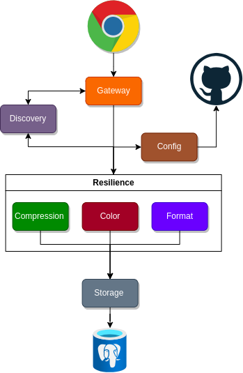
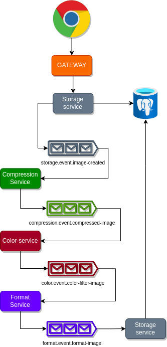

# Pixel Wave

# Pixelwave - Sistema Distribuído

Bem-vindo ao repositório do projeto Pixelwave, uma aplicação dedicada ao processamento de imagens que oferece uma plataforma simplificada para operações de manipulação de imagem. O sistema é dividido em microsserviços especializados, abrangendo desde o armazenamento de imagens até a aplicação de filtros de cor, troca de formatos e redução do tamanho.

### Repositórios

1. **Arquitetura Request-Response:**

   - [Repositório Request-Response](https://github.com/FelipeLM1/pixel-wave)

2. **Arquitetura Event-Driven (RabbitMQ):**

   - [Repositório Event-Driven RabbitMQ](https://github.com/FelipeLM1/pixel-wave/tree/event-driven)

3. **Arquitetura Event-Driven (Kafka):**

   - [Repositório Event-Driven Kafka](https://github.com/FelipeLM1/pixel-wave/tree/event-drive-kafka)

4. **Config Service Repository:**
   - [Config Repository](https://github.com/FelipeLM1/pixel-wave-config-repository)

## Microsserviços e Regras de Negócio

1. **Storage (Armazenamento):**

   - Gerenciamento do armazenamento e recuperação de imagens.

2. **Color (Cor):**

   - Aplicação de filtros de cor em imagens, permitindo personalização.

3. **Format (Formato):**

   - Troca de formato de imagem para flexibilidade na manipulação.

4. **Compression (Compressão):**
   - Redução do tamanho das imagens para otimização de armazenamento.

Cada microsserviço opera independentemente, executando regras de negócio especializadas e contribuindo para o processamento eficiente de imagens.

## Implementação com Arquitetura de Requisição e Resposta

Na implementação inicial do projeto, foi adotada uma arquitetura centrada em requisições e respostas para facilitar a comunicação entre os microsserviços. A [Figura 1](#figura-1-arquitetura-request-response) mostra um diagrama da arquitetura.

### Figura 1: Arquitetura Request Response

1. **Storage (Armazenamento):**

   - Atua como repositório central de imagens, respondendo a solicitações para armazenar e recuperar dados.

2. **Color (Cor):**

   - Recebe solicitações do cliente através do Gateway, consulta o Storage de forma síncrona para obter a imagem original, aplica o filtro de cor e retorna o resultado ao cliente.

3. **Format (Formato):**

   - Similar ao Color, segue uma abordagem síncrona. Recebe requisições do Gateway, busca a imagem no Storage, realiza a troca de formato e devolve o resultado na mesma requisição.

4. **Compression (Compressão):**
   - Coordenado pelo Gateway, também opera de maneira síncrona. Ao receber uma solicitação, busca a imagem no Storage, executa a compressão e responde com a imagem otimizada.

A infraestrutura conta com o Discovery Service para descoberta dinâmica de serviços e o Config Server para gerenciamento desacoplado de configurações.

Essa implementação request-response proporciona um fluxo claro e controlado de operações, facilitando a compreensão e manutenção do código.

## Implementação com Arquitetura Orientada a Eventos

Na transição para a arquitetura orientada a eventos no projeto PixelWave, o fluxo de requisições foi redesenhado para otimizar a escalabilidade e a eficiência. A [Figura 2](#figura-2-arquitetura-event-driven-pixelwave) ilustra o novo pipeline de eventos, onde cada serviço executa uma tarefa específica, proporcionando uma abordagem assíncrona e altamente flexível.

### Figura 2: Arquitetura Event-Driven PixelWave

O processo inicia-se com um endpoint dedicado: `/storage-service/images/process/1`. Esse endpoint recebe parâmetros essenciais, como `name`, `color`, `scale` e `format`. O serviço de Storage recebe essa requisição, busca a imagem associada e a coloca em uma fila específica `storage.event.image-created`.

Os demais microsserviços, agora transformados em consumidores de eventos, operam da seguinte maneira:

1. **Compression Service:**

   - Escuta a fila `storage.event.image-created`, obtém a imagem, realiza o processo de compressão para redução de tamanho e a coloca em outra fila `compression.event.compressed-image`.

2. **Color Service:**

   - Recebe eventos da fila `compression.event.compressed-image`, aplica o filtro de cor à imagem e a coloca em uma nova fila `color.event.color-filter-image`.

3. **Format Service:**

   - Escuta a fila `color.event.color-filter-image`, formata a imagem conforme necessário e a coloca na fila `format.event.format-image`.

4. **Storage Service (Persistência):**
   - O serviço de Storage, por fim, escuta a fila `format.event.format-image` e salva a imagem processada no banco de dados.

Esse pipeline de eventos representa uma abordagem altamente eficiente, onde cada microsserviço realiza sua tarefa de maneira assíncrona, sem interrupções, contribuindo para uma arquitetura mais escalável.
